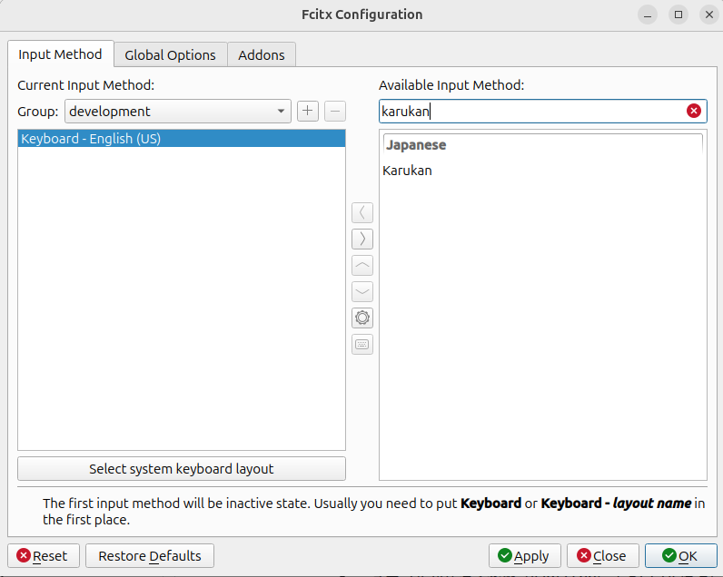
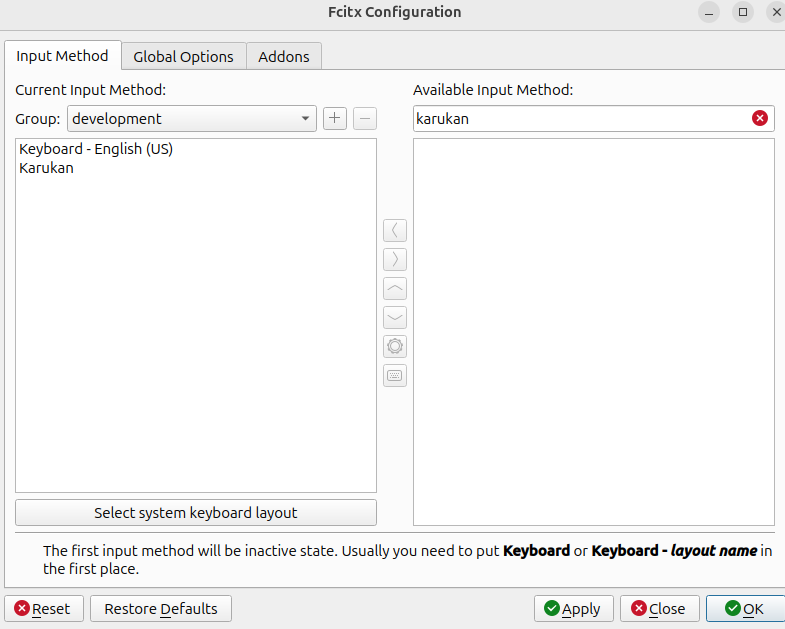

# karukan-fcitx5

Linux向け日本語IME（fcitx5アドオン）。[karukan-im](../karukan-im) エンジンをC FFI経由でラップし、fcitx5上でニューラルかな漢字変換を提供します。

キーバインド・設定・辞書・学習キャッシュについては [karukan-im の README](../karukan-im/README.md) を参照してください。

## Install

### Prerequisites

- [Rust](https://www.rust-lang.org/tools/install)

```bash
sudo apt install fcitx5 fcitx5-modules-dev libfcitx5core-dev \
    libfcitx5config-dev libfcitx5utils-dev extra-cmake-modules \
    cmake make gcc g++ pkg-config \
    clang libclang-dev \
    libssl-dev libxkbcommon-dev
```

- `cmake`, `make`, `gcc`, `g++`: C/C++ ビルドツール（llama.cpp のビルドに必要）
- `pkg-config`: ライブラリ検出
- `clang`, `libclang-dev`: bindgen による FFI バインディング生成に必要
- `libssl-dev`: HTTPS通信（モデルダウンロード等）
- `libxkbcommon-dev`: キーボード処理

### Build & Install (システムインストール)

`/usr` にインストールします。sudo が必要ですが、`FCITX_ADDON_DIRS` の設定は不要です。

```bash
cd karukan-fcitx5/fcitx5-addon
cmake -B build -DCMAKE_INSTALL_PREFIX=/usr
cmake --build build -j
sudo cmake --install build
fcitx5 -r
```

### Build & Install (ユーザーローカル)

`~/.local` にインストールします。sudo 不要ですが、`FCITX_ADDON_DIRS` の手動設定が必要です。

```bash
cd karukan-fcitx5/fcitx5-addon
cmake -B build -DCMAKE_INSTALL_PREFIX=$HOME/.local
cmake --build build -j
cmake --install build
```

ローカルインストールの場合、fcitx5 がアドオンを見つけられるように `FCITX_ADDON_DIRS` を設定する必要があります。fcitx5 はログインセッション開始時に起動されるため、シェルプロファイルではなく `~/.config/environment.d/` に設定してください:

```bash
mkdir -p ~/.config/environment.d
SYSTEM_FCITX5_DIR=$(pkg-config --variable=libdir Fcitx5Core)/fcitx5
echo "FCITX_ADDON_DIRS=$HOME/.local/lib/fcitx5:$SYSTEM_FCITX5_DIR" \
    > ~/.config/environment.d/fcitx5-karukan.conf
```

> [!IMPORTANT]
> `FCITX_ADDON_DIRS` にはローカルパスとシステムパスの両方を含める必要があります。システムパスが欠けると fcitx5 の標準アドオン（wayland、classicui 等）が見つからなくなります。

設定後、ログアウトして再ログインしてください。再ログイン後、fcitx5 のログに `Loaded addon karukan` が表示されることを確認してください:

```bash
fcitx5 -r -d
```

```
I2026-02-24 22:57:54.252982 addonmanager.cpp:195] Loaded addon karukan
```

> [!WARNING]
> 以前のバージョンで `install-local.sh` を使用した場合、`~/.config/environment.d/fcitx5-karukan.conf` にシステムパスを含まない `FCITX_ADDON_DIRS`（例: `FCITX_ADDON_DIRS=/home/user/.local/lib/fcitx5`）が設定されている可能性があります。このファイルが残っていると fcitx5 のシステムアドオンが見つからなくなります:
>
> ```
> E addonloader.cpp:32] Could not locate library libwayland.so for addon wayland.
> E addonloader.cpp:32] Could not locate library libclassicui.so for addon classicui.
> ```
>
> この場合はファイルを削除した上でログアウト（または再起動）してください:
>
> ```bash
> rm ~/.config/environment.d/fcitx5-karukan.conf
> ```

インストール後、fcitx5-configtool（Fcitx Configuration）を開き、右側の「Available Input Method」で「karukan」を検索して「Karukan」を左側に追加してください。





> [!NOTE]
> 初回起動時にHuggingFaceからGGUFモデル（GGUF + tokenizer）を自動ダウンロードするため、起動に数分かかる場合があります。ダウンロード中はfcitx5のログに以下のような進捗が表示されます:
>
> ```
> I2026-02-24 23:12:12.651828 addonmanager.cpp:195] Loaded addon karukan
> jinen-v1-small-Q5_K_M.gguf [00:00:05] [████████████████████████] 84.39 MiB/84.39 MiB 7.89 MiB/s (0s)
> tokenizer.json [00:00:00] [████████████████████████████████] 1.95 MiB/1.95 MiB 6.45 MiB/s (0s)
> jinen-v1-xsmall-Q5_K_M.gguf [00:00:02] [████████████████████████] 29.73 MiB/29.73 MiB 9.15 MiB/s (0s)
> tokenizer.json [00:00:00] [████████████████████████████████] 1.95 MiB/1.95 MiB 8.45 MiB/s (0s)
> ```
>
> ダウンロードが完了するまで変換機能は使用できません。2回目以降はキャッシュ済みのモデルが使われるため、すぐに起動します。

## Surrounding Text

エディタからカーソル位置周辺のテキストを取得し、変換精度を向上させます。

例えば「虫歯の治療のために」の後に「はいしゃ」を変換すると、文脈から「歯医者」が候補になります。文脈なしでは「廃車」など一般的な候補が優先されます。

Surrounding Textはfcitx5のAPI経由で提供されますが、**多くのLinuxアプリケーションでは未対応です**（参考: [csslayer's blog](https://www.csslayer.info/wordpress/fcitx-dev/why-surrounding-text-is-the-worst-feature-in-the-linux-input-method-world/)）。

> [!NOTE]
> Surrounding Text周りの挙動は現在調査中です。正しく動作しない場合があります。
